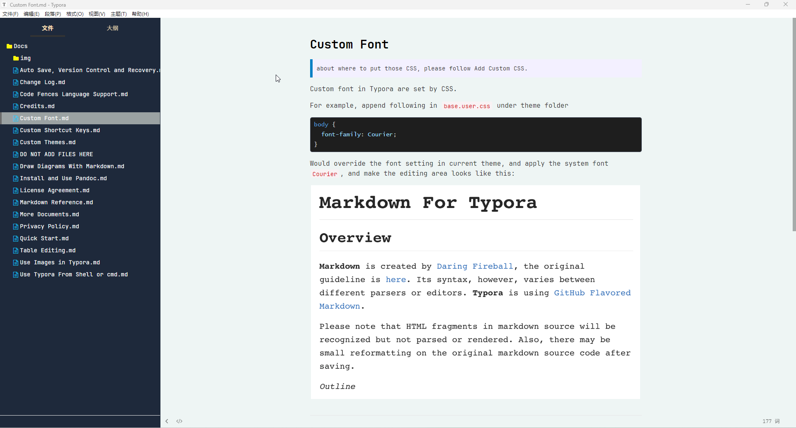
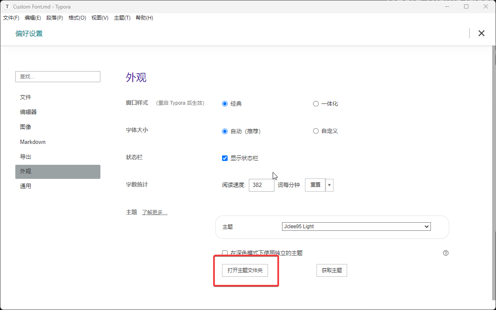

# Typora Theme jclee95

## 介绍

一款用于 Typora 的主题。这个主题我对Sidebar的颜色以及编辑区的颜色进行了一些设置。其中代码部分，采用的是类似于 VSCode 的深色主题配色方案。预览效果如下。

## 如何安装

打开 Typora => 文件 => 偏好设置 => 外观

点击 “打开主题文件夹” 按钮。然后将文件复制进去就可以了，需要复制css和其同名文件夹。